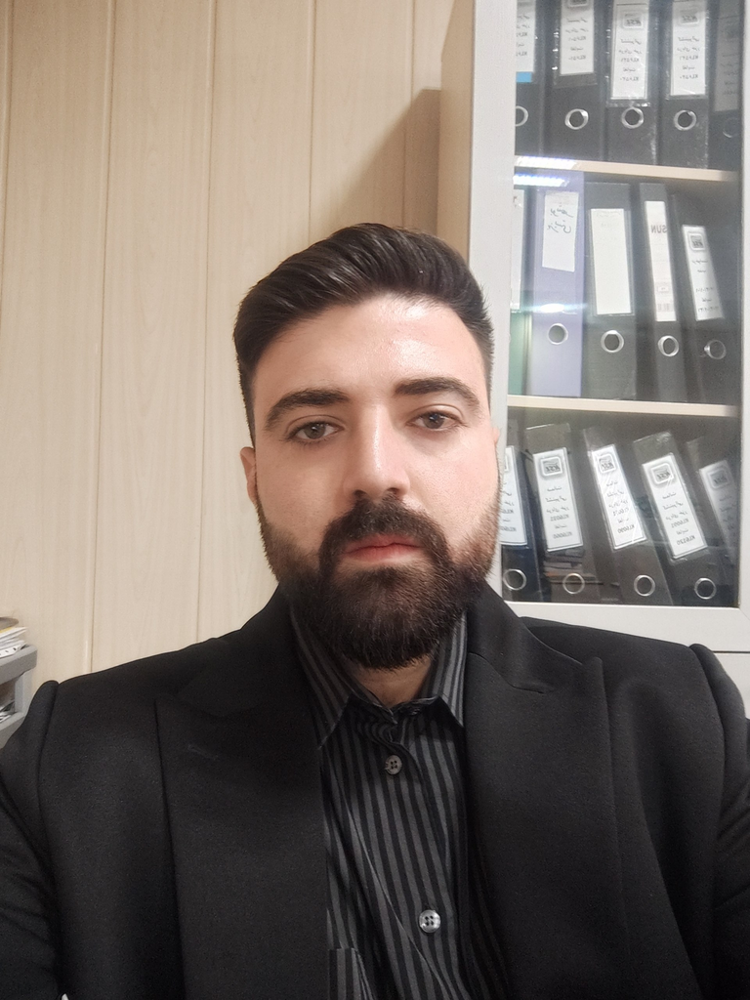

# پروژه ۱: تصاویر ترکیبی (Hybrid Images)

[](https://github.com/ParsaHajiAshrafi/hybrid-images-project/actions/workflows/tests.yml)

پیاده‌سازی کامل فیلترگذاری دوبعدی از صفر با Python و NumPy و ساخت یک تصویر
ترکیبی که در فاصله‌های مختلف، دو برداشت بصری متفاوت ایجاد می‌کند.

در خروجی این پروژه، از فاصله نزدیک جزئیات حالت لبخند دیده می‌شود؛ با دورشدن
از تصویر یا کوچک‌کردن آن، حالت خنثی چهره غالب می‌شود.

## نتیجه نهایی

| ورودی پایین‌گذر (`left.png`) | ورودی بالاگذر (`right.png`) | خروجی (`hybrid.png`) |
|:---:|:---:|:---:|
|  |  |  |

## ایده اصلی

سیستم بینایی در فاصله نزدیک، جزئیات ریز یا فرکانس‌های بالا را بهتر تشخیص
می‌دهد؛ اما در فاصله دور، ساختار کلی و فرکانس‌های پایین غالب می‌شوند. تصویر
ترکیبی از رابطه زیر ساخته شده است:

```text
Hybrid = 0.95 * LowPass(left) + 1.25 * HighPass(right)
HighPass(image) = image - LowPass(image)
```

## توابع پیاده‌سازی‌شده

تمام منطق فیلترگذاری در `hybrid.py` نوشته شده است:

1. `cross_correlation_2d(img, kernel)`
   - اعمال هم‌بستگی متقابل روی تصویر خاکستری یا رنگی
   - حفظ ابعاد ورودی با zero padding
   - پشتیبانی از کرنل‌های مستطیلی با ابعاد زوج یا فرد
2. `convolve_2d(img, kernel)`
   - چرخاندن کرنل در هر دو محور
   - استفاده از `cross_correlation_2d`
3. `gaussian_blur_kernel_2d(sigma, height, width)`
   - تولید کرنل گاوسی نرمال‌شده با مجموع دقیقاً برابر یک
4. `low_pass(img, sigma, size)`
   - حذف جزئیات ریز به کمک کانولوشن گاوسی پیاده‌سازی‌شده در پروژه
5. `high_pass(img, sigma, size)`
   - استخراج جزئیات ریز از طریق تفاضل تصویر اصلی و نسخه پایین‌گذر

در این پیاده‌سازی از هیچ تابع آماده فیلترگذاری در NumPy، SciPy، OpenCV یا
Pillow استفاده نشده است. حلقه‌ها روی ضرایب کرنل اجرا می‌شوند و عملیات پیکسل‌ها
با NumPy برداری شده‌اند.

## پارامترهای خروجی نهایی

| مؤلفه | تصویر منبع | اندازه کرنل | سیگما | وزن ترکیب |
|---|---|---:|---:|---:|
| پایین‌گذر | `left.png`، حالت خنثی | `37x37` | `6.0` | `0.95` |
| بالاگذر | `right.png`، حالت لبخند | `17x17` | `2.5` | `1.25` |

این مقادیر بعد از ساخت و مقایسه چند خروجی انتخاب شدند. هر سه تصویر نهایی RGB
و دارای ابعاد `768x1024` پیکسل هستند.

## ساختار مخزن

```text
.
|-- gui.py                 # ابزار انتخاب نقاط و هم‌ترازی آفین
|-- hybrid.py              # پیاده‌سازی فیلترها و برنامه ساخت خروجی
|-- test_hybrid.py         # آزمون‌های واحد
|-- correspondence.json    # نقاط متناظر انتخاب‌شده برای هم‌ترازی
|-- left.png               # ورودی پایین‌گذر هم‌ترازشده
|-- right.png              # ورودی بالاگذر هم‌ترازشده
|-- hybrid.png             # خروجی نهایی
|-- requirements.txt       # وابستگی‌های پروژه
|-- .github/workflows/     # اجرای خودکار آزمون‌ها در GitHub Actions
`-- README.md
```

## نصب و اجرا

Python 3.10 یا جدیدتر پیشنهاد می‌شود.

```bash
python -m venv .venv
```

فعال‌سازی محیط مجازی در Windows PowerShell:

```powershell
.venv\Scripts\Activate.ps1
pip install -r requirements.txt
```

ساخت دوباره خروجی نهایی با پارامترهای پیش‌فرض ثبت‌شده در کد:

```bash
python hybrid.py left.png right.png -o hybrid.png
```

برای آزمایش پارامترهای دیگر:

```bash
python hybrid.py left.png right.png -o custom-hybrid.png \
  --low-sigma 6 --low-kernel 37 \
  --high-sigma 2.5 --high-kernel 17 \
  --low-weight 0.95 --high-weight 1.25
```

## هم‌ترازی تصاویر

برای عکس‌های جدید می‌توان رابط گرافیکی ارائه‌شده را اجرا کرد:

```bash
python gui.py photo1.jpg photo2.jpg -n 3 -o aligned
```

ابتدا یک نقطه روی تصویر اول و سپس نقطه متناظر آن روی تصویر دوم انتخاب می‌شود.
برای چهره، مراکز دو چشم و نوک بینی نقاط مناسبی هستند. برنامه تبدیل آفین را
محاسبه و فایل‌های `left.png` و `right.png` را تولید می‌کند.

نقاط استفاده‌شده برای تصاویر فعلی در `correspondence.json` نگهداری شده‌اند تا
فرآیند هم‌ترازی قابل بازتولید باشد.

## آزمون‌ها

```bash
python -m unittest -v test_hybrid.py
```

آزمون‌ها موارد زیر را بررسی می‌کنند:

- عملکرد کرنل همانی روی تصویر خاکستری و RGB
- چرخش صحیح کرنل در کانولوشن
- تقارن و نرمال‌بودن کرنل گاوسی
- بازسازی تصویر اصلی از جمع مؤلفه‌های پایین‌گذر و بالاگذر

نتیجه فعلی: تمام ۵ آزمون با موفقیت پاس می‌شوند.

## وابستگی‌ها

- NumPy
- Pillow
- Matplotlib، فقط برای رابط گرافیکی هم‌ترازی
